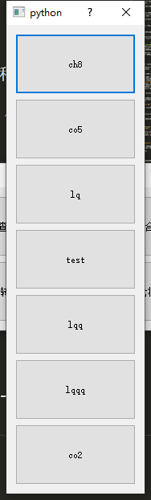
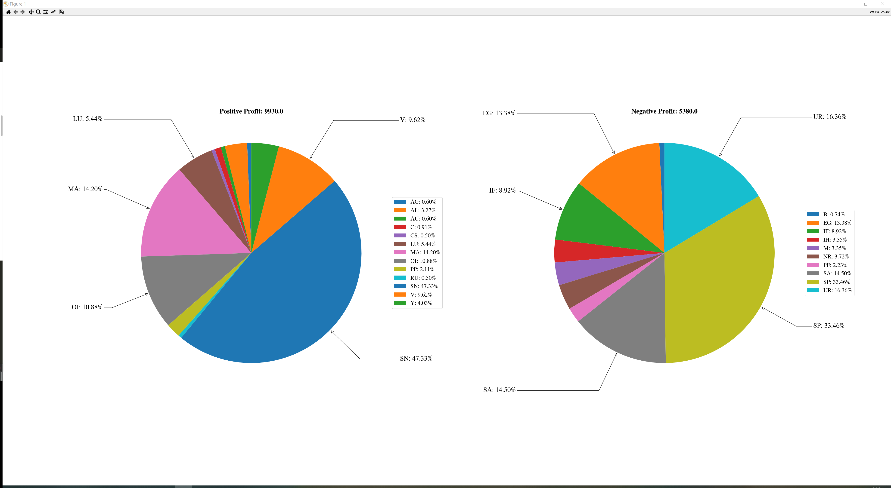

# CTA_UI使用说明
## 账户管理

- 通过上方按钮进行账户表操作，从左到右依次为：
  1. 更新Boundary参数（暂未稳定实装）
  2. 增加账户
  3. 删除账户
  4. 编辑账户
  5. 账户上移
  6. 账户下移
- 增删改的操作通过勾选最左侧的Checkbox使用
- 【保存与分发】Ctrl + S 会保存当前的账户表，并立刻根据当前账户表的数据把基表（BASE）参数表分发给所有子账户
### 配置建议
0. CTA_UI/params/BASE目录下放置基参数表，**之后**才启动程序，进行初始化
1. 如果程序已经运行中，但需要拷贝替换参数表文件，则操作文件后在程序中Ctrl+R刷新参数表，重新读取拷贝后的文件
2. 建立自己的账户表，添加账户后使用Ctrl+S将参数表按自己的设置分发给各个账户对应目录下
3. 在RDP主机上安装OpenSSH：解压缩后将目录拷贝至C:\Program Files\OpenSSH【另需服务器打开22端口】
```
Set-ExecutionPolicy RemoteSigned

cd C:\Program Files\OpenSSH

powershell.exe -ExecutionPolicy Bypass -File install-sshd.ps1

net start sshd

# OPTIONAL but recommended:
Set-Service -Name sshd -StartupType 'Automatic'

# Confirm the Firewall rule is configured. It should be created automatically by setup. Run the following to verify
if (!(Get-NetFirewallRule -Name "OpenSSH-Server-In-TCP" -ErrorAction SilentlyContinue | Select-Object Name, Enabled)) {
    Write-Output "Firewall Rule 'OpenSSH-Server-In-TCP' does not exist, creating it..."
    New-NetFirewallRule -Name 'OpenSSH-Server-In-TCP' -DisplayName 'OpenSSH Server (sshd)' -Enabled True -Direction Inbound -Protocol TCP -Action Allow -LocalPort 22
} else {
    Write-Output "Firewall rule 'OpenSSH-Server-In-TCP' has been created and exists."
}
```
4. 制作账户链路config文件置于sftp_configs目录
## 参数表增删改查
1. 最重要的，操作后的记得Ctrl + S保存，会同时保存参数表的更改，并把新表分发给各个账户

**事故记录**:配置UI的时候使用以下顺序导致了参数表污染:启动程序->读取我的参数表进内存->拷入目标参数表->使用分发功能触发内存中我的参数表进行分发
**解决方案**:确定使用正确的基表启动程序
1. 增添套利对：
  - 工具箱-检查参数表 ==> 会根据当前基表的参数情况，在数据库中查找可转抛与不可转抛套利对，按主动腿成交量降序排列

  - 勾引后点添加，填入参数。注意第一行都要填，第一个空是drift。随时可以点击套利对按钮查看Barplot, 兼容参数表使用和不使用SP指令的情况，如果不勾选则参数表没有SP指令字段


1. 删除套利对: 参数表界面勾选套利对左边的checkbox后，Ctrl + D
2. 修改参数表：双击表格即可，修改完之后Ctrl+S保存
3. 查询套利对图像：BarPlot列点击即可查看，添加参数表填表的时候也可以点击标有套利对名字的蓝色按钮查看
4. 开启/关闭合约组：工具箱-开启/关闭合约组，是一种快捷操作**if_add**列的方式, 勾选你希望控制的合约组，左拉是关闭，右拉是开启

1. 导出实时持仓：工具箱-实时持仓状态，会看到配置文件中包含的所有账户, 点击其中一个查看持仓盈亏（只额外标注占比5%以上的品种）
<center class="half">
    
</center>


## 文件传输、监控链路


### 文件传输链路表
| 功能                             | 起点                  | 终点                                                                                                                                                       | 备注                         | 文件         | 运行位置  |
|--------------------------------|---------------------|----------------------------------------------------------------------------------------------------------------------------------------------------------|----------------------------|------------|-------|
| pull_from_UI_to_cloud          | UI    | 云服务器  | 从本地上传到云服务器                 | 参数表，链路配置文件 | UI    |
| request_from_cloud_to_UI       | 云服务器  | UI    | 从云服务器下载文件到本地               | 持仓记录，交易记录  | UI    |
| pull_from_UI_to_market         | UI    | 行情服务器 | 通过云服务器建立反向隧道，从本地上传文件到行情服务器 | 参数表，链路配置文件 | UI    |
| pull_from_UI_to_market         | UI | 交易服务器    | 当行情服务器为localhost时          | 参数表  | UI    |
| pull_from_market_to_trading    | 行情服务器 | 交易服务器 | 从行情服务器上传到交易服务器             | 参数表        | 行情服务器 |
| request_from_trading_to_market | 交易服务器 | 行情服务器 | 从交易服务器下载文件到行情服务器           | 持仓记录，交易记录  | 行情服务器 |
| pull_from_market_to_cloud      | 行情服务器 | cloud | 从行情服务器上传到云服务器，链路7完成时自动触发   | 持仓记录，交易记录  | 行情服务器 |
| request_from_market_to_UI      | 行情服务器 | UI    | 未实装，目前UI通过链路2获取日志文件        | 持仓记录，交易记录  | 行情服务器 |

####监控与任务表
| 服务器   | 监控目录              | 定时任务                                                                                                                                                   | 变化捕捉             |
|-------|-------------------|--------------------------------------------------------------------------------------------------------------------------------------------------------|------------------|
| UI    | CTA_UI根目录         | 15:03：下载持仓和交易记录至本地                                                                                                                                     | 捕捉文件新增           |
| 云服务器  | ~/CTA             | 无                                                                                                                                                      | 捕捉文件变化           |
| 行情服务器 | mktDir所在根目录       | 15:02：导出持仓和交易记录                                                                                                                                        | 捕捉文件新增<br>捕捉文件变化 |
| 交易服务器 | tradeDirList的每个账户 | 20:55-02:30：运行交易程序<br>02:35-08:50：终止交易，清理日志<br>08:55-11:30：运行交易程序<br>11:35-13:20：终止交易，清理日志<br>13:25-15:00：运行交易程序<br>15:00-20:55：导出持仓和成交记录<br>终止交易，清理日志 | 不捕捉              |
|       |                   |                                                                                                                                                        |                  |

| 服务器   | 任务/捕捉细则                                                     | 使用功能                                                        |
|-------|-------------------------------------------------------------|-------------------------------------------------------------|
| UI    | 定时任务：导出持仓和交易记录 【行情端与UI分离，从云服务器获取】                           | request_from_cloud_to_UI                                    |
| UI    | 定时任务：导出持仓和交易记录 【行情端在本地，从交易服务器直连获取】                          | request_from_trading_to_market                              |
| 云服务器  | 文件修改捕捉：计算参数表变更写入changelog.txt日志                             | compare_csv_file                                            |
| 云服务器  | 文件修改捕捉：当参数表发生变化时，转发给交易端<br>计算参数表变更写入changelog.txt日志"        | pull_from_market_to_trading<br>compare_csv_file             |
| 行情服务器 | 定时任务：导出持仓和交易记录<br>文件新增捕捉：转发给云服务器                            | request_from_trading_to_market<br>pull_from_market_to_cloud |
| 交易服务器 | 运行/终止程序：init_CTP / shutdown_CTP <br> 清理日志：delete_glog_limit | 略                                                           |

  
### 链路config文件配置说明
- 位置：UI根目录/sftp_configs
- 一个RDP主机和一个Config文件一一映射，链路配置文件请不要以**limit.json** or **config.json** or **configure.json** or **configure.xml**，避免混淆其他程序需要读取的配置文件
#### 例子 lq.json（推荐以账户名命名）
```
{
    "userName" : "hh",                                                              --@交易员名称，俊哥账户的我测试的时候用的feng可以考虑沿用，是云服务器和行情服务器存储记录的根目录

    "cloudServer": {                                                                --@云服务器配置，除了"reverse_port"都不用动
        "host": "39.97.106.35",                                                           reverse_port是反向端口，是行情服务器和本地UI之间建立连接走的端口，目前在服务器上开了9870-9876之间的所有端口
        "port" : 22,                                                                      当行情服务器是一个单独的远程服务器的时候，反向端口会被使用，如果行情服务器就在本地，说明此条链路的本地UI与交易服务器是可以RDP直连的，则反向端口字段可有可无
        "username": "root",
        "pwd": "Wojiaomt1",
        "reverse_port": 9870
    },

    "marketServer": {                                                               --@行情服务器配置，当行情服务器就是本地UI的时候，行情服务器的概念形同虚设，"host"直接填特殊的"localhost"，其他字段可以不要，程序会进行判断
        "host": "localhost",                                                              当行情服务器是单独的远程主机，和本地UI分离时，"host"填写行情服务器所在以太网的IP地址（行情端的内网地址），其他字段根据例子里填写
        "port": 22,                                                                       "mktDir"是行情服务器作为UI和交易服务器的中间站时，进行转发的文件存储目录
        "username": "Han.Hao",
        "pwd": "123",
        "mktDir": "D:\\CTA_mkt\\mktdata\\"
    },

    "tradeServer": {                                                                --@交易服务器配置，"host"是RDP主机的内网地址，需要交易服务器安装SSH的Server端，port一般为22，username和pwd为远程主机账户密码
        "host": "172.31.113.251",
        "port" : 22,
        "username": "Administrator",
        "pwd": "Abc@123"
    },

    "localUIDir": "D:\\local_repo\\CTA_UI",                                         --@本地UI程序所在目录
    
    "accountList": ["lq"],                                                          --@该链路终点RDP服务器的交易账户，支持使用列表同时操作多个账户，例如之间huajing34服务器上["ch3","ch5"]

    "tradeDirList": ["C:\\Users\\Administrator\\Desktop\\cta_lq_zx\\"]              --@链路终点RDP（交易服务器）放置交易程序的目录
}
```

##### 传输方式【已通过代码实现，这里只留下记录】：
- 方案1： 不做内网穿透，云服务器做中转中枢
- 方案2： 做内网穿透，云服务器做备份
- 方案3： 用云服务器做反向SSH的内网穿透【已通过paramiko实现】
  
1. 在云服务器上，确保 SSH 服务已启动，并且允许反向隧道连接。你可以编辑 `/etc/ssh/sshd_config` 文件，确保以下配置项未被注释或设置为正确的值：

   ```
   GatewayPorts yes
   AllowTcpForwarding yes
   ```
   之后记得重启服务器的SSHD: systemctl restart sshd

2. 在本地主机上，使用以下命令建立反向 SSH 隧道，将本地主机的某个端口（例如 8888）转发到云服务器上的 SSH 端口（默认为 22）：

   ```bash
   ssh -i <私钥文件路径> -R 8888:localhost:22 <云服务器用户名>@<云服务器IP地址>
   ```
   以某行情服务器为例，在行情服务器上运行 ssh -R 9876:localhost:22 root@39.97.106.35
   为了确保本地主机上的反向 SSH 隧道长时间存在并保持连接，使用 SSH 的 KeepAlive 机制：
   使用 SSH 的 TCPKeepAlive 选项：在云服务器上的 SSH 配置文件 `/etc/ssh/sshd_config` 中，你可以设置 `TCPKeepAlive yes`，以确保 SSH 服务器也发送 KeepAlive 消息。这样可以防止服务器端因为长时间没有活动而关闭连接。
   请注意，修改 SSH 服务器配置后，你需要重启 SSH 服务以使更改生效。
   在建立反向 SSH 隧道时，可以通过 `-o ServerAliveInterval=<秒数>` 参数设置 SSH 的 KeepAlive 间隔时间。例如：-o ServerAliveInterval=60

   ```bash
   ssh -i <私钥文件路径> -o ServerAliveInterval=60 -R 8888:localhost:22 <云服务器用户名>@<云服务器IP地址>
   ```
   UI端推送参数表的时候，一方面给云服务器推送。另一方面给行情服务器直接推送。
   推送时使用Paramiko建立SSH连接，等价命令: SSH -p 9876 adminstrator[行情服务器用户]@39.97.106.35[云服务器公网IP]

   请注意替换 `<私钥文件路径>`、`<云服务器用户名>` 和 `<云服务器IP地址>` 为你实际的值。

3. 在云服务器上，安装并配置 inotify 工具。例如，在 Ubuntu 上，你可以使用以下命令安装 inotify-tools：

   ```bash
   sudo apt-get install inotify-tools
   ```

4. 创建一个 Bash 脚本，用于监控云服务器上的文件变化并触发同步操作。以下是一个示例脚本：

   ```bash
   #!/bin/bash

   SOURCE_DIR="<云服务器文件目录>"
   DEST_DIR="<本地主机文件目录>"

   inotifywait -m -r -e modify,create,delete "$SOURCE_DIR" |
   while read path action file; do
       rsync --inplace --update -e "ssh -p 8888" "$SOURCE_DIR/$file" "$DEST_DIR/$file"
   done
   ```

   请注意替换 `<云服务器文件目录>` 和 `<本地主机文件目录>` 为你实际的值。

   上述脚本使用 inotifywait 监控指定的云服务器文件目录，当文件发生修改、创建或删除时，将触发 rsync 命令进行同步。rsync 命令使用反向 SSH 隧道的端口（8888）连接到本地主机。

5. 在云服务器上运行上述脚本：

   ```bash
   bash sync_script.sh
   ```

   脚本将开始监控云服务器上的文件变化，并在文件发生更改时触发同步操作。

### 市场服务器OpenSSH服务启动
- 方式1：WindowsServer中-设置-应用与功能-OpenSSH服务器
- 方式2：手动安装使用说明目录下的openssh安装包

```
cd C:\Program Files\OpenSSH
powershell.exe -ExecutionPolicy Bypass -File install-sshd.ps1
net start sshd
Set-Service sshd -StartupType Automatic

# Start the sshd service
Start-Service sshd

# OPTIONAL but recommended:
Set-Service -Name sshd -StartupType 'Automatic'

# Confirm the Firewall rule is configured. It should be created automatically by setup. Run the following to verify
if (!(Get-NetFirewallRule -Name "OpenSSH-Server-In-TCP" -ErrorAction SilentlyContinue | Select-Object Name, Enabled)) {
    Write-Output "Firewall Rule 'OpenSSH-Server-In-TCP' does not exist, creating it..."
    New-NetFirewallRule -Name 'OpenSSH-Server-In-TCP' -DisplayName 'OpenSSH Server (sshd)' -Enabled True -Direction Inbound -Protocol TCP -Action Allow -LocalPort 22
} else {
    Write-Output "Firewall rule 'OpenSSH-Server-In-TCP' has been created and exists."
}
```
### 市场服务器功能启动
- 将utils中的file_monitor.py文件直接移出包目录，放置于config中对应的市场服务器目录下。直接运行即可。
- 市场服务器目录结构如下：
-marketServerDir
--utils
--sftp_configs
--file_monitor.py
--(usrs/account/file)后续的文件会自动生成在目录下

## 日常BarPlot（暂略）
- 目前每个交易单元结束后自动运行

## Boundary数据集导出与参数计算（暂略）
- 数据导出：utils.extract_boundary_dataset
- 参数计算: utils.calculate_parameter


# 交易服务器脚本说明
## 交易程序：trading_server_moniter.exe
- 路径eg：同上例，交易程序所在文件夹为C:\\Users\\Administrator\\Desktop\\cta_lq_zx
- /cta_lq_zx/ {CTPtest-GetPosAndTrd.exe} & {CTPtest-test.exe} & {trading_server_monitor.exe} [在同一目录下]
- 功能：
  1. 开盘前收盘后自动启动和终止CTPtest-test的交易进程
   - 终止的事件顺序：程序收盘前撤单 -> 收盘后杀进程
  2. 收盘后自动导出CTPtest-GetPosAntTrd的交易日志
  3. 收盘后自动清理glog和LimitValue文件
## CTPtest-GetPosAndTrd.exe 持仓交易导出程序configure实例：
- 文件名:configure.json, 例如，交易程序所在的文件夹是C:\\Users\\Administrator\\Desktop\\cta_lq_zx,则：
```
{
  "EveryCfg": [
    {
     "PosOutFilePath": "C:\\Users\\Administrator\\Desktop\\cta_lq_zx\\report\\holding",
     "TrdOutFilePath": "C:\\Users\\Administrator\\Desktop\\cta_lq_zx\\tradings\\trading",
      "BrokerID": "66666",
      "InvesterID": "xxxxx",
      "InvesterPassword": "xxxxx",
      "AuthCode": "xxxxx",
      "AppID": "client_xsqq_1.0.0",
      "TradeFrontAddr": "tcp://172.31.xx.xxx:43205"
    }
  ]
}
```
- 持仓文件会存储为：C:\\Users\\Administrator\\Desktop\\cta_lq_zx\\report\\holding_YYMMDD.csv
- 交易记录会存储为：C:\\Users\\Administrator\\Desktop\\cta_lq_zx\\tradings\\trading_YYMMDD.csv
- 建议将路径设置为交易程序所在文件夹 + \\report\\holding  与 交易程序所在文件夹 + \\tradings\\trading


# V1.0更新日志
- （已实现）修改主界面参数表展示
- （已实现）完善基表子表使用逻辑：Boundary Info目录下留界缓存，Param目录下每次更新/计算参数表之后留下带交易单元时间信息后缀的缓存。但是直接使用的是账号目录下的params.csv 
- （已实现）每当用户修改参数表并保存时，应该同步更新info目录下的region_info.xlsx，保证其实时为最新
- （已实现）修改Ctrl+S保存功能，使其同样保存参数表
- （已实现）实现修改参数表数据的功能-增删套利对-增：检查参数表最好重新做一个class, 直接检查基表就行
1. (已实现)添加参数的时候窗口锁死，干脆直接把图片链接加进来不就完事了吗
2. (已实现)异常处理，空值
3. (已实现)添加删除套利对的快捷键，最好ctrl+z能撤回
- 工具箱
1. （已实现）检查参数表，用于增加套利对
2. 查看不可转抛、反套持仓
3. （已实现）Mute月份合约
4. （已实现）持仓(TmpValue & DB实时数据 -> 持仓盈亏 / 持仓构成) -- estHoldingDialog
- 完善一些进度条
- （已完成一半）窗口大小设置优化
- 参数表适配SP指令（新增SP模块）- get_sp_instruction
- （已实现）根据账户系数(budget)修改参数表的功能没有实装（参数计算模块需要整体做相应的适配）
- （问题不大）UI目前使用起来有一些卡顿
- （已实现）pandasModel的列宽有些不够，应该根据内容的长短适应性改变尺寸
- Boundary计算模块
- （已实现）异常处理 任务日志加一下
- （已实现）链路 SSH实现，一个链路对应一个终点RDP对应一个Config
- UI中链路可视化 链路编辑 设置默认链路组合，每次传输的时候走Default链路组合
- （已实现）参数表修改日志，在云服务器运行计算
- （已废案）使用rsync进行与中枢服务器保存的日志文件同步到本地：
`rsync_example = "rsync -avPz --port 8730 --password-file=/cygdrive/C/Users/Han.Hao/AppData/Local/cwrsync/bin/cta_password.txt root@39.97.106.35::cta/ /cygdrive/C/Users/Han.Hao/test"`
`rsync_pwd_path` & `rsync dest path`
- （已实现）使用watchdog进行与中枢服务器保存的日志文件同步到本地
  
# 更新日志
## V1.1
- （已实现）参数表在上传至云端服务器时，会保存为带有时间戳后缀的形式，作为备份
- （已实现）给UI增加主动刷新参数表的功能，可以在后台替换新的基表之后，让程序的内存重新加载新的基表，并在UI前端加载新的基表
**快捷键 Ctrl + R** 我才意识到这个功能早就写好了只是没有实装，搞了波大亏QNMLGB
- （已废案）优化了交易记录计算功能，现在遇到难以直接匹配的套利对，会考虑无法匹配部分long/short的比值，根据以下情况进行分类
  1. long/short比值无法整除或者有一者为0：必有瘸腿，不撮合，分开写入交易记录末尾
  2. long/short比值为整数：结构套，直接撮合，按比率在交易记录末尾写入
- （已实现）修复参数表分发给不同规模账户时budget运算的数据类型错误，为max/min_position字段也添加了比例分发

## V1.2
- 完善绘图功能的窗口交互，添加绘图每日任务配置功能
- 完善弹性模型界计算的窗口交互
- 将UI路径参数从代码中分离出来，放在另一个配置文件中，方便修改
- （已实现）上传参数表的时候弹出确认窗口
- （已实现）检查参数表添加筛选品种功能 --> 添加参数表现在会按品种字母序排列
- （已实现）收盘自动备份参数表 - YYMMDD
- （已实现）文件链路模块适配Linux系统
- （已实现）收盘时的日志文件/参数表提取提前到14:59
- （已实现）在文件传输失败后，返回失败的日志或提示，不阻塞程序的继续运行

### v1.2.1
- （已实现）优化了刷新功能的逻辑，解决了越用越卡的问题
- （已实现）套利对盈亏簿记功能

### v1.2.2
- （已实现）默认只在UI中显示参数表的少部分列
- （已实现）通过ignore功能控制不同账户交易基表中的不同标的
- （已实现）自适应程序的根目录，不再需要手动设置

### v1.2.3
- （已实现）UI展示类的自定义功能（包括增删）
  
### v1.2.4
- UI展示类的自定义功能（合成region目标价位）
- 实装Boundary弹性模型计算模块

### v1.2.5
- （已实现）优化了const中的静态参数，避免过度引用的情况
- （已实现）优化了文件链路中市场服务器与交易服务器的交互，修正因linux交易服务器产生的路径符号问题
- （已实现）修正使用市场服务器时，下载日志文件到本地UI时的逻辑
- （已实现）修正了Ignore功能，使其在UI启动时自动刷新到最新的账户和参数表状态
- （已实现）优化了数据库模块对client对象的依赖，现在启动UI可以不连接数据库离线启动
-  (已实现) 修正了由于加入Min_Step导致添加参数不生效的bug

### v1.2.6
- (已实现) 排除了一些窗口下没有用异常处理导致的闪退
- (已实现) 为主界面参数表添加回了checkbox用以删除套利对
- 多账户管理时，控制某一个账户更新参数表的同时不开仓
